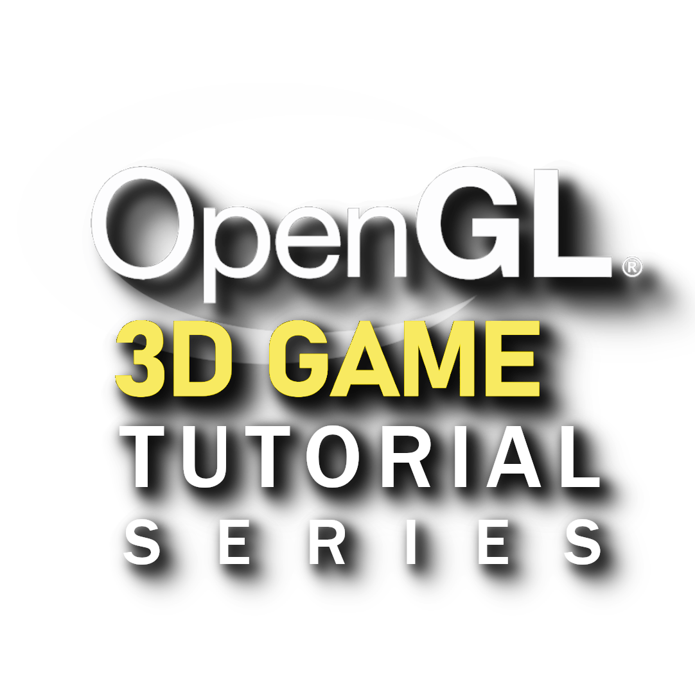

[]()
[](https://discord.gg/RymBzwKPyZ)
[](https://www.patreon.com/pardcode)
[](https://www.youtube.com/channel/UCs1ssVSR49YItKE7DZ3-Jcw)

[`C++ OpenGL 3D Game Tutorial Series`](https://www.youtube.com/playlist?list=PLv8DnRaQOs5-TyYnF56YghOxQBNr1VVmF) is a YouTube Tutorial Series,</br>
whose purpose is to help all those who want to take their first steps in the game development from scratch.</br>
In this series you'll learn how to create a Cross-Platform OpenGL 3D Game in C++ from scratch, starting from the creation of a Window by using Win32, Cocoa and X11 APIs (Windows, macOS and Linux respectively)</br>
to the making of all the necessary sub-systems in order to achieve a complete 3D Game, like</br>

- OpenGL 3D Graphics Engine</br>
 Vertex Array Object (VAO)</br>
 Shaders</br>
 Uniform Buffer Object (UBO)</br>
 ...</br>
- Entity System</br>
- Input System</br>
- ...</br>


---

For any **questions**, **doubts** or **clarifications** about the `OpenGL 3D Game Tutorial Series`, you can join
the [discord server](https://discord.gg/RymBzwKPyZ), where you can meet other users or developers like you.<br/>
Before to ask any question, check the [FAQs](https://github.com/PardCode/OpenGL-3D-Game-Tutorial-Series/wiki/Frequently-Asked-Questions).
The answers you are searching for could be already there.<br/>
You can find the license [here](#license).

---

This project is available under a free and permissive license, but needs a financial support to sustain its development.<br/> 
The development includes both the making of video tutorials and the writing of the code.<br/> 
Consider to support it through [`Patreon`](https://www.patreon.com/pardcode).<br/>  
Every single contribution makes the difference, regardless the amount.<br/>
Many thanks to all **the patrons** who have supported me so far! <br/>
  
[](https://www.patreon.com/pardcode)  

# License

The license of this project is based on the modified MIT-License.

That means you can do whatever you want with the code available in this repository. 
The only conditions to meet are:

- include the license text in your product (e.g. in the About Window of a GUI program, or Credits Section of a 2D/3D Visual Game)
- include (or simply not delete) the license text in all the source code files you get from this repository (copy-paste the license text to the top of all the source code files you get from this repository, even if you have partially modified them. )


If you want to modify and redistribute the source code files available in this repository, you can optionally add your own copyright notice together with the license text in this way:

```
...
C++ OpenGL 3D Game Tutorial Series (https://github.com/PardCode/OpenGL-3D-Game-Tutorial-Series)
<project name>, <website link or nothing>
  
Copyright (c) 2021-2022, PardCode
Copyright (c) <your years>, <your name>  
...
```

The license text is available in the [`LICENSE`](https://github.com/PardCode/OpenGL-3D-Game-Tutorial-Series/blob/tutorials/LICENSE) file.

